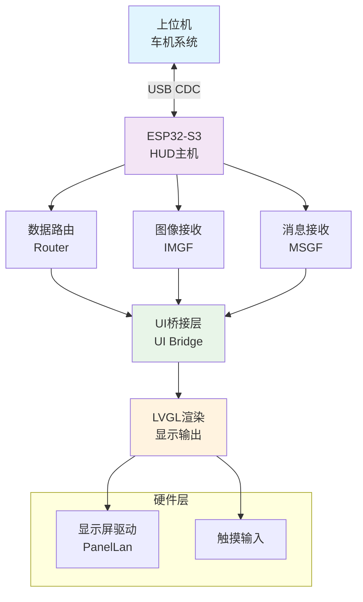
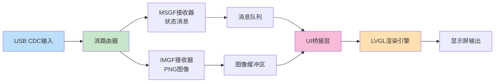
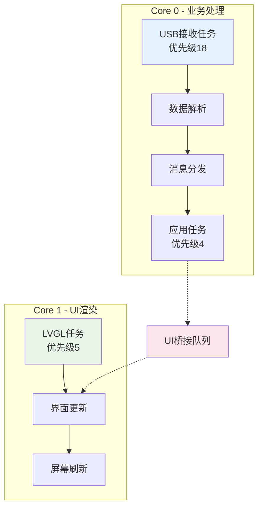

# ESP_HUD - 基于ESP32的抬头显示器(HUD)


> ⚠️ **重要声明**: 本项目完全由AI生成和构建，所有代码和文档均由人工智能编写完成。

## 📋 项目简介

ESP_HUD是一个基于ESP32-S3的抬头显示器(HUD)项目，专为车载应用设计。该系统通过USB CDC接口接收来自上位机（车机）的实时数据，包括：
- **车身状态数据**：车速、转速、里程、温度、电池电压等
- **导航地图数据**：轨迹叠加的地图PNG图像

所有数据经过高效解析后，通过LVGL图形库渲染显示在480×320的彩色显示屏上，为驾驶员提供直观的行车信息展示。

## 🏗️ 系统架构

### 核心组件架构图



### 数据流向图



### 线程模型图



### 主要模块说明

#### 🔧 硬件抽象层
- **[boards.h/.cpp](src/board/boards.h)**: 多种开发板支持(SC01+, SC02, SC05, KC01, BC02, SC07)
- **[PanelLan.h/.cpp](src/PanelLan.h)**: 显示屏驱动封装

#### 🔄 数据通信层
- **[usb_stream_router.h/.c](include/usb_stream_router.h)**: USB流路由器，负责数据分发
- **[imgf_receiver.h/.c](include/imgf_receiver.h)**: PNG图像帧接收器
- **[msgf_receiver.h/.c](include/msgf_receiver.h)**: 状态消息帧接收器

#### 🎨 用户界面层
- **[lvgl_port.h/.cpp](include/lvgl_port.h)**: LVGL图形库移植和初始化
- **[ui_bridge.h/.cpp](include/ui_bridge.h)**: UI更新桥接层，实现线程安全的界面更新
- **[SquareLine UI](src/squareline/)**: 基于SquareLine Studio设计的仪表盘界面

#### 🎮 应用逻辑层
- **[main.cpp](src/main.cpp)**: 系统入口和任务调度
- **[host_pc.py](example/host_pc.py)**: 上位机模拟器示例

## 📊 通信协议

### 帧格式定义

所有数据帧采用统一的20字节头部格式：

```c
typedef struct __attribute__((packed)) {
    uint32_t magic;     // 魔数('MSGF'或'IMGF')
    uint8_t  type;      // 帧类型
    uint8_t  flags;     // 标志位
    uint16_t rsv;       // 保留字段
    uint32_t len;       // 数据长度
    uint32_t crc32;     // CRC校验(可选)
    uint32_t seq;       // 序列号
} usb_sr_hdr_t;
```

### MSGF消息帧 (车身状态数据)

| 偏移 | 大小 | 类型 | 描述 |
|------|------|------|------|
| 0 | 2 | int16 | 车速(km/h) |
| 2 | 2 | int16 | 发动机转速(rpm) |
| 4 | 4 | int32 | 总里程(m) |
| 8 | 4 | int32 | 行程里程(m) |
| 12 | 2 | int16 | 外部温度(℃) |
| 14 | 2 | int16 | 内部温度(℃) |
| 16 | 2 | int16 | 电池电压(mV) |
| 18 | 2 | uint16 | 当前时间(分钟数) |
| 20 | 2 | uint16 | 行程时间(分钟) |

### IMGF图像帧 (PNG地图数据)
- 直接传输PNG格式的图像数据
- 支持最大128KB的图像大小
- 采用零拷贝技术优化性能

## 🚀 快速开始

### 硬件要求

- **主控芯片**: ESP32-S3 (推荐16MB Flash + 2MB PSRAM)
- **显示屏**: 480×320 RGB LCD屏幕
- **开发板**: 支持SC01+, SC02, SC05, KC01, BC02, SC07等
- **连接**: USB-CDC接口用于数据通信

### 开发环境搭建

1. **安装PlatformIO**
   请访问[PlatformIO官网](https://platformio.org/install/ide?install=vscode)按照官方指南在VSCode中安装PlatformIO IDE插件

2. **克隆项目**
   ```bash
   git clone https://github.com/yourusername/ESP_HUD.git
   cd ESP_HUD
   ```

3. **安装依赖库**
   ```ini
   [env:sc01_plus]
   lib_deps =
       lovyan03/LovyanGFX@1.1.12
       lvgl/lvgl@8.3.11
   ```

### 编译和烧录

```bash
# 编译项目
pio run

# 烧录固件
pio run --target upload

# 监视串口输出
pio run --target monitor
```

### 配置说明

在`platformio.ini`中根据实际硬件调整配置：

```ini
[env:your_board]
board = esp32-s3-devkitc-1
board_build.flash_size = 16MB
board_build.psram_size = 2MB
build_flags =
    -DBOARD_HAS_PSRAM
    -DARDUINO_USB_CDC_ON_BOOT=1
```

## 💻 上位机测试

项目提供了Python测试脚本用于模拟上位机数据发送：

```bash
# 安装依赖
pip install pyserial

# 运行演示模式(24Hz消息 + 定时PNG)
python example/host_pc.py --port COM5 --mode demo --png test_map.png

# 发送单次数据
python example/host_pc.py --port COM5 --mode once --speed 80 --rpm 1800
```

## 🛠️ 开发指南

### 添加新的显示元素

1. 在SquareLine Studio中设计UI界面
2. 导出代码到`src/squareline/`目录
3. 在`ui_bridge.cpp`中添加对应的更新函数
4. 修改消息解析逻辑以支持新数据字段

### 扩展通信协议

```c
// 在msgf_receiver中添加新的消息类型
typedef enum {
    MSG_TYPE_STATUS = 0,
    MSG_TYPE_WARNING = 1,
    MSG_TYPE_CUSTOM = 2  // 新增自定义类型
} msg_type_t;
```

### 性能优化建议

- 启用PSRAM支持以处理大尺寸图像
- 使用双缓冲机制减少屏幕撕裂
- 合理设置任务优先级避免UI卡顿
- 实现数据压缩减少传输带宽

## 📈 性能指标

| 指标 | 数值 |
|------|------|
| 显示刷新率 | 20Hz |
| 消息处理频率 | 24Hz |
| 图像更新延迟 | <50ms |
| 内存占用 | ~2MB RAM |
| Flash占用 | ~4MB |

## 🔧 故障排除

### 常见问题

1. **屏幕无显示**
   - 检查电源供电是否正常
   - 确认显示屏型号配置正确
   - 验证LVGL初始化是否成功

2. **数据接收异常**
   - 检查USB CDC连接状态
   - 验证波特率设置(115200)
   - 确认上位机数据格式正确

3. **图像显示错误**
   - 检查PNG文件格式兼容性
   - 验证图像尺寸不超过限制
   - 确认PSRAM分配足够

### 调试技巧

```cpp
// 启用详细日志
#define DEBUG_ROUTER 1
#define DEBUG_IMGF 1
#define DEBUG_MSGF 1

// 内存监控
Serial.printf("Free heap: %d bytes\n", ESP.getFreeHeap());
Serial.printf("Free PSRAM: %d bytes\n", ESP.getFreePsram());
```

## 🤝 贡献指南

欢迎提交Issue和Pull Request！

### 开发流程
1. Fork项目仓库
2. 创建功能分支 (`git checkout -b feature/AmazingFeature`)
3. 提交更改 (`git commit -m 'Add some AmazingFeature'`)
4. 推送到分支 (`git push origin feature/AmazingFeature`)
5. 开启Pull Request

### 代码规范
- 遵循C++11标准
- 使用4空格缩进
- 函数和变量命名采用snake_case
- 添加必要的注释和文档

## 📄 许可证

本项目采用MIT许可证 - 查看[LICENSE](LICENSE)文件了解详情

## 🙏 致谢

特别感谢以下开源项目和硬件支持：

- [LVGL](https://lvgl.io/) - 强大的嵌入式图形库
- [LovyanGFX](https://github.com/lovyan03/LovyanGFX) - 优秀的显示屏驱动库
- [SquareLine Studio](https://squareline.io/) - 专业的UI设计工具
- [PanelLan_esp32_arduino](https://github.com/smartpanle/PanelLan_esp32_arduino) - 提供启明智显(Qiming Zhixian)屏幕的BSP支持
- [PlatformIO](https://platformio.org/) - 跨平台IoT开发生态


---
> Made with ❤️ for embedded automotive applications*
> *⚠️ 本项目完全由AI生成和构建*